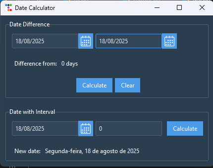
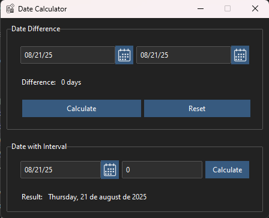

# Date Calc - Calculadora de Datas

Uma calculadora de datas intuitiva e eficiente, desenvolvida em Python. Permite calcular diferenças entre datas, adicionar ou subtrair dias e visualizar resultados de forma clara através de uma interface gráfica moderna ou via linha de comando.

## ✨ Funcionalidades

*   **Cálculo de Diferença:** Calcule facilmente o número de dias, duas datas.
*   **Adição/Subtração:** Adicione ou subtraia um número específico de dias, semanas, meses ou anos a partir de uma data de origem.
*   **Interface Dupla:** Use o programa pela Interface Gráfica (GUI) amigável ou pela Interface de Linha de Comando (CLI) para automação.
*   **Design Moderno:** GUI construída com TkInter e TtkBootstrap para uma experiência visual agradável e moderna.

## 🖼️ Screenshots

| Versão 1.1.0 (Baseada em Funções) | Versão 2.1.0 (Baseada em Classes - Atual) |
| :---: | :---: |
| [](assets/v1.1.0.png) | [](assets/v2.1.0.png) |

## 🚀 Instalação e Uso

Recomenda-se a instalação via `pipx` para um isolamento adequado e disponibilidade global do aplicativo.

### Instalação Direta do GitHub (Método Recomendado)

```bash
pipx install git+https://github.com/seu_usuario/date_calc.git
```

### Instalação a partir de um Arquivo WHL
Baixe o arquivo .whl mais recente na página de Releases.

No terminal, navegue até a pasta onde o arquivo foi baixado.

Execute o comando:

```bash
pipx install ./date_calc-*.whl
```

## Como Usar
Após a instalação, o comando date-calc estará disponível globalmente no seu terminal.

Para abrir a Interface Gráfica:

```bash
dtcalc-gui
```
Para usar a CLI (exemplo):

```bash
dtcalc --help
```

## 🛠️ Tecnologias Utilizadas
* Python 3.12.9
* datetime (Biblioteca Padrão)
* TkInter (Biblioteca Padrão para GUI)
* TtkBootstrap 1.14.2 (Para estilos modernos na interface)
* Poetry 2.0.1 (Para gerenciamento de dependências e empacotamento)
* Git (Para controle de versão)

## 📦 Desenvolvimento
Este projeto é gerenciado com Poetry.

### Clone o repositório:

```bash
git clone https://github.com/seu_usuario/date_calc.git
cd date_calc
```

### Instale as dependências:
```bash
poetry install
```

### Ative o ambiente virtual:
Se você acabou de baixar o projeto e não tem nenhum virtualenv, o comando abaixo cria um virtualenv com o python global de sua máquina. Este projeto utiliza python 3.12:
```bash
poetry env use path/to/python3.12
```
O comando acima vai criar e ativar um ambiente virtual para o projeto.
Para ativá-lo no terminal dedicado da sua IDE, utilize o comando abaixo que irá retornar o caminho do interpretador do virtualenv criado pelo poetry para o projeto:
```bash
poetry env activate
```
Conhecendo o caminho do ambiente virtual:
```bash
source <path/to/the/virtualenv/of/poetry> 
```

### Execute o aplicativo em modo de desenvolvimento:

```bash
poetry run python -m date_calc
```

## 📝 Histórico de Versões
- v2.1.0: Reestruturação completa da GUI utilizando Programação Orientada a Objetos (Herança e classes especializadas).
- v1.1.0: Versão inicial com GUI construída sobre funções.